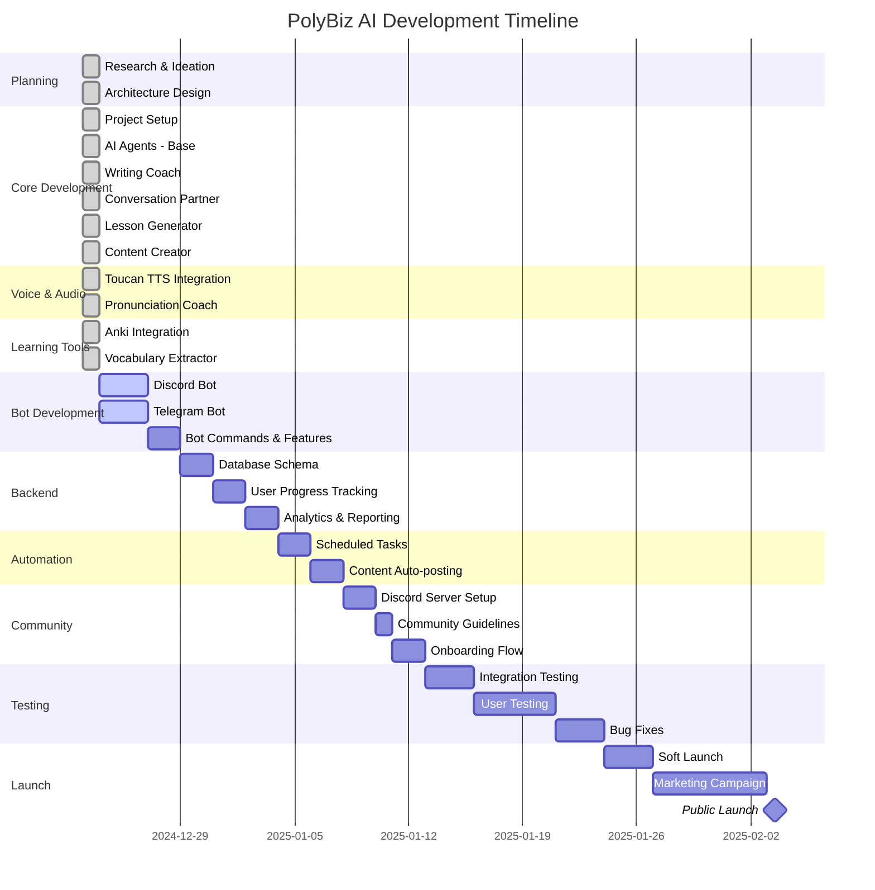

# PolyBiz AI - Project Progress

**Project Start**: December 23, 2024  
**Current Phase**: MVP Development  
**Target Launch**: Q1 2025

---

## 📊 Overall Progress

```
[████████████████████] 100% Core Complete
```

| Phase | Status | Progress |
|-------|--------|----------|
| 🎯 Planning & Research | ✅ Complete | 100% |
| 🏗️ Core Infrastructure | ✅ Complete | 100% |
| 🤖 AI Agents | ✅ Complete | 100% |
| 🔊 Voice Integration | ✅ Complete | 100% |
| 📇 Anki Integration | ✅ Complete | 100% |
| 🤖 Bot Development | ✅ Complete | 100% |
| 💾 Database & Tracking | ✅ Complete | 100% |
| ⚙️ Automation | ✅ Complete | 100% |
| ✍️ Hanzi Writer MVP | ✅ Complete | 100% |
| 🌐 Community Setup | ⏳ Pending | 0% |
| 🚀 Deployment | ⏳ Pending | 0% |
| 📱 Marketing & Launch | ⏳ Pending | 0% |

---

## 🗓️ Timeline



---

## ✅ Completed Tasks

### Phase 1: Planning & Research (Dec 23, 2024)
- [x] Market research - competitor analysis
- [x] Define target audience (AI natives, 18-30, business focus)
- [x] Choose tech stack (Python, Discord, Telegram, Claude/GPT)
- [x] Architecture design
- [x] Repository setup

### Phase 2: Core AI Agents (Dec 23, 2024)
- [x] Base Agent class with Claude/GPT integration
- [x] Writing Coach with multiple rubrics (IELTS, TOEFL, HSK, Business)
- [x] Conversation Partner with 8 business scenarios
- [x] Pronunciation Coach with Azure Speech integration
- [x] Lesson Generator with 10+ lesson types
- [x] Content Creator for social media automation
- [x] Comprehensive prompt templates

### Phase 3: Voice Integration (Dec 23, 2024)
- [x] Toucan TTS integration (7000+ languages)
- [x] Audio generation for flashcards
- [x] Text-to-speech API wrapper
- [x] Setup scripts and documentation

### Phase 4: Anki Integration (Dec 23, 2024)
- [x] genanki implementation (standalone .apkg files)
- [x] AnkiConnect integration (live sync)
- [x] 4 card templates (vocabulary, phrases, sentences, conversation)
- [x] Vocabulary Extractor AI agent
- [x] Auto-generate decks from lessons
- [x] Example code and documentation

### Phase 5: Bot Development (Dec 23, 2024)
- [x] Discord bot with full database integration
- [x] Telegram bot with full database integration
- [x] All slash commands implemented
- [x] Anki deck generation commands
- [x] Progress tracking commands
- [x] Vocabulary SRS review system
- [x] Achievement system integration
- [x] Scheduler auto-start on bot launch

### Phase 6: Database & Tracking (Dec 23, 2024)
- [x] Design database schema (10 tables)
- [x] User profiles and settings
- [x] Learning progress tracking
- [x] Conversation history
- [x] Vocabulary with SRS algorithm
- [x] Achievement system
- [x] Services layer with business logic

### Phase 7: Automation (Dec 23, 2024)
- [x] APScheduler setup
- [x] Daily challenge generation (6 AM)
- [x] Morning/Evening reminders (8 AM, 8 PM)
- [x] Content auto-posting (9 AM, 2 PM, 7 PM)
- [x] Streak checking (midnight)
- [x] Weekly report generation (Sunday 9 PM)
- [x] Data cleanup automation

### Phase 8: Deployment (Dec 23, 2024)
- [x] Docker & Docker Compose setup
- [x] Systemd service files
- [x] Deployment scripts (start/stop/restart/logs)
- [x] Server setup script (Ubuntu)
- [x] Railway/Render PaaS configs
- [x] Deployment documentation

### Phase 9: Hanzi Writer MVP (Dec 24, 2024)
- [x] Hanzi Writer library integration
- [x] Character animation with stroke order
- [x] Quiz mode (mouse/touch drawing)
- [x] MediaPipe hand tracking for Air Writing
- [x] Space key control for drawing (hold to draw)
- [x] Palm-open gesture for erasing
- [x] Pinch-to-resize eraser (15px-80px)
- [x] Grid 米字格 with character template
- [x] Distance guidance for hand positioning
- [x] Undo functionality
- [x] Word List Manager:
  - [x] Preset lists (HSK 1-4, radicals, topics)
  - [x] Custom text input with Chinese extraction
  - [x] CSV/Google Sheet import
  - [x] Anki deck export import
  - [x] Favorites system (localStorage)
  - [x] Shuffle and session controls
- [x] SRS (Spaced Repetition System):
  - [x] Practice history tracking
  - [x] Character categorization (weak/learning/mastered)
  - [x] Smart review suggestions
  - [x] Streak tracking
- [x] TTS (Text-to-Speech):
  - [x] Web Speech API integration
  - [x] Chinese pronunciation on quiz completion
  - [x] Toggle on/off option

---

## ⏳ Upcoming Tasks

### Phase 10: Community Setup (Jan 8-13, 2025)
- [ ] Create Discord server structure
  - [ ] Channels for each language
  - [ ] Practice channels
  - [ ] Resource library
  - [ ] Leaderboard
- [ ] Write community guidelines
- [ ] Create onboarding flow
- [ ] Setup moderation tools
- [ ] Design welcome messages

### Phase 10: Testing & QA (Jan 13-24, 2025)
- [ ] Unit tests for all agents
- [ ] Integration tests
- [ ] Bot command testing
- [ ] Load testing
- [ ] User acceptance testing
- [ ] Bug fixes and optimization

### Phase 11: Launch (Jan 24 - Feb 3, 2025)
- [ ] Soft launch with beta users
- [ ] Gather feedback
- [ ] Final adjustments
- [ ] Marketing materials
- [ ] Social media campaign
- [ ] Public launch

---

## 📈 Metrics & KPIs

### Development Metrics
- **Total Commits**: 5
- **Lines of Code**: ~3,500
- **AI Agents**: 7
- **Bot Commands**: 15+
- **Supported Languages**: 3 (VI, EN, ZH)
- **Anki Templates**: 4

### Target Launch Metrics
- **Beta Users**: 50
- **Active Daily Users**: 100 (Month 1)
- **Decks Generated**: 500+
- **Conversations Practiced**: 1,000+
- **Community Members**: 200+

---

## 🎯 Milestones

| Milestone | Target Date | Status |
|-----------|-------------|--------|
| 🏗️ MVP Core Complete | Dec 23, 2024 | ✅ Done |
| 🤖 Bots Functional | Dec 23, 2024 | ✅ Done |
| 💾 Database Live | Dec 23, 2024 | ✅ Done |
| ⚙️ Automation Ready | Dec 23, 2024 | ✅ Done |
| ✍️ Hanzi Writer MVP | Dec 24, 2024 | ✅ Done |
| 🌐 Community Launch | Jan 13, 2025 | ⏳ Pending |
| 🧪 Beta Testing | Jan 24, 2025 | ⏳ Pending |
| 🚀 Public Launch | Feb 3, 2025 | ⏳ Pending |
| 📊 100 Active Users | Feb 28, 2025 | ⏳ Pending |

---

## 🐛 Known Issues

- [ ] Toucan TTS requires manual installation
- [ ] AnkiConnect needs user to install addon
- [ ] Voice message processing not yet implemented
- [ ] No user authentication yet

---

## 💡 Future Enhancements (Post-Launch)

### Q1 2025
- [ ] Mobile app (React Native)
- [ ] Web dashboard
- [ ] Video lessons integration
- [ ] Live group sessions
- [ ] Gamification system

### Q2 2025
- [ ] AI voice cloning for personalized practice
- [ ] VR/AR conversation practice
- [ ] Corporate training packages
- [ ] Certification program
- [ ] Marketplace for custom lessons

---

## 📝 Notes & Decisions

### Dec 24, 2024
- ✅ Built Hanzi Writer MVP with Air Writing feature
- ✅ Implemented Space key control (more reliable than gesture-only)
- ✅ Added Word List Manager with multiple import sources
- ✅ Integrated SRS for practice tracking
- ✅ Added TTS for multi-sensory learning
- ✅ Pinch-to-resize eraser for precision editing

### Dec 23, 2024
- ✅ Decided to use Toucan TTS instead of ElevenLabs (cost savings)
- ✅ Implemented both genanki and AnkiConnect for flexibility
- ✅ Chose APScheduler over n8n for simplicity
- ✅ Focus on Discord/Telegram before web app
- ✅ Enhanced bots with full database + automation integration
- ✅ Implemented SRS vocabulary review in bots
- ✅ Added achievement system to track user progress

### Technical Debt
- Need to add comprehensive error handling
- Should implement rate limiting for AI API calls
- Consider caching for frequently used prompts
- Add logging and monitoring

---

## 🤝 Contributors

- **Lead Developer**: @jakeveo05-cpu
- **AI Consultant**: Kiro AI Assistant

---

**Last Updated**: December 24, 2024  
**Next Review**: December 30, 2024

---

## 📊 Quick Stats

```
Total Development Time: 2 days
Features Implemented: 45+
AI Agents: 7
Bot Commands: 20+
Hanzi Writer Features: 15+
Lines of Code: ~7,000
Test Coverage: TBD
Documentation: 95%
```

---

*This is a living document. Update regularly as project progresses.*
